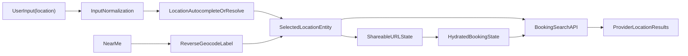

# Prompt: Production-ready Location Search for Service Booking
## Role: Senior Fullstack Developer

## Контекст проекта
Проект `PetsCare` состоит из:
- backend: Django/DRF/PostGIS в `PetsCare-backend`
- frontend: React/TypeScript/Vite в `Petscare-web`

В продукте уже есть booking flow поиска услуг и записи, но поиск локации пока не готов к продакшену. Сейчас он работает как MVP:
- на фронте location передается либо как сырая строка `locationQuery`, либо как `lat/lon`
- на бэке `location_query` ищется простым `icontains` по полям адреса
- нет канонической модели выбранной локации
- нет production-grade autocomplete/select flow для location
- нет устойчивой поддержки разных языков, раскладок и способов ввода

## Подтвержденная проблема
Проблема не гипотетическая, а уже воспроизведенная на живых данных.

Сценарий:
- пользователь ищет услугу `Первичный осмотр и консультация`
- локация вводится как `Берлин`
- выбран питомец `petId=18`
- в URL и запросе присутствует `category=initial_exam_consultation` / `category_id=20`

Факт:
- с `location_query=Berlin` находится филиал `1 точка` провайдера `Roga und Copyta UG`
- с `location_query=Берлин` результат пустой

Корневая причина:
- backend search по локации сейчас не канонический и не мультиязычный
- ввод пользователя матчится только буквальным `icontains`
- в данных адрес хранится как `Berlin`, а пользователь в русской локали вводит `Берлин`

Это production bug, а не UX-шероховатость.

## Что уже есть в кодовой базе

### Backend
- Booking search:
  - `PetsCare/booking/flow_views.py`
- Address/geolocation layer:
  - `PetsCare/geolocation/models.py`
  - `PetsCare/geolocation/views.py`
  - `PetsCare/geolocation/services.py`
- Provider location:
  - `PetsCare/providers/models.py`

### Frontend
- Booking search UI:
  - `Petscare-web/src/components/booking/Omnibox.tsx`
  - `Petscare-web/src/components/booking/LocationPicker.tsx`
  - `Petscare-web/src/contexts/BookingFlowContext.tsx`
  - `Petscare-web/src/services/bookingFlowAPI.ts`
- Existing address-related infra, которую можно переиспользовать:
  - `Petscare-web/src/services/providerAPI.ts`
  - `Petscare-web/src/components/provider-registration/Step2BasicInfo.tsx`

## Важные наблюдения по текущей реализации

### 1. Текущий backend booking search
Сейчас `location_query` фильтрует `ProviderLocation` по сырым адресным полям:

```python
if location_query:
    locations = locations.filter(
        Q(name__icontains=location_query) |
        Q(provider__name__icontains=location_query) |
        Q(structured_address__formatted_address__icontains=location_query) |
        Q(structured_address__city__icontains=location_query) |
        Q(structured_address__street__icontains=location_query) |
        Q(structured_address__district__icontains=location_query) |
        Q(structured_address__postal_code__icontains=location_query)
    ).distinct()
```

Это не решает:
- `Berlin` vs `Берлин`
- `München` vs `Munchen`
- геолокацию как выбранное место, а не как просто координаты
- восстановление location state из shareable URL

### 2. Текущий frontend flow
Сейчас ручной ввод location уходит как raw string:

```ts
const trimmed = addressInput.trim();
if (!trimmed) return;
setUserLocation(null);
setLocationQuery(trimmed);
onSearch({ locationQuery: trimmed, clearCoords: true });
```

Это означает:
- нет distinction между "я просто напечатал строку" и "я выбрал конкретную локацию из suggestions"
- нет `place_id`
- нет canonical label
- нет normalized location payload
- нет устойчивого round-trip между URL, state и backend search

### 3. В проекте уже есть geolocation infrastructure
У проекта уже есть базовые building blocks:
- `POST /api/v1/autocomplete/`
- `POST /api/v1/place-details/`
- `POST /api/v1/geocode/`
- `POST /api/v1/reverse-geocode/`

Но они не интегрированы в booking flow как production-ready location search.

Дополнительно важно:
- в `GoogleMapsService.autocomplete_address()` язык сейчас захардкожен как `en`
- `place_id` не является first-class полем в боевой модели адреса/локации
- нет alias/transliteration/canonical entity layer

## Твоя роль
Ты Senior Fullstack Developer (Django + React/TypeScript + product thinking).

Твоя задача:
довести location search в booking flow до production quality без косметических полумер.

Нужен не "патч на Берлин", а системное решение для мультиязычного и канонического поиска локации.

## Product goal
Пользователь должен иметь возможность искать услуги по локации так, как ему удобно:
- на русском
- на английском
- с диакритикой или без нее
- через autocomplete
- через "рядом со мной"
- через ручной ввод адреса/города

И система должна корректно находить одну и ту же локацию независимо от формы ввода, если это один и тот же реальный place.

## Definition of Done
Фича считается готовой только если одновременно выполняется следующее:

1. `Berlin`, `Берлин`, `berlin` и близкие канонически эквивалентные формы дают одинаковую выдачу по location search.
2. При выборе location из suggestions в search state живет не только строка, а нормализованная сущность выбранного места.
3. Геолокация пользователя дает человекочитаемый label, а не просто голые `lat/lon`.
4. Shareable URL корректно восстанавливает location state после reload/open in new tab.
5. Существующий service search и booking flow не ломаются.
6. Есть backend и frontend regression tests.
7. Есть smoke-test сценарии на прод-подобном окружении.

## Scope
В scope этой задачи входит:
- canonical location search для booking flow
- frontend autocomplete/select flow для location
- typed location + selected suggestion + geolocation + reverse-geocode label
- API contract для location search state
- backward compatibility с существующим `location_query`
- regression tests и rollout criteria

## Non-goals
В scope не входит:
- полный redesign booking modal
- полный redesign карты
- переписывание всего service search с нуля
- миграция всего проекта на стороннюю search engine
- full-text search по всему проекту за пределами location use case

Если в ходе работы потребуется слегка затронуть соседние части flow, делай это только там, где это нужно для production-ready location search.

## Целевая архитектура



## Обязательная целевая модель
Нужно уйти от модели:
- `location = string OR coords`

и перейти к модели:
- `location = selected canonical place entity`
- плюс fallback для свободного текста, если place не выбран

Минимум, который нужно продумать:
- `label`
- `normalized_query`
- `place_id` или другой устойчивый canonical key
- `lat`
- `lon`
- `city`
- `country`
- `source` (`typed`, `suggestion`, `geolocation`, `url`)

## Что нужно сделать на backend

### 1. Спроектировать canonical location search
Используй существующий geolocation слой, но приведи его к production-ready логике.

Нужно:
- определить canonical search strategy для локации
- поддержать alias/transliteration/normalization
- не полагаться только на literal `icontains`
- решить, где и как хранить canonical identifier:
  - `place_id`
  - normalized fields
  - alias table
  - или другой устойчивый search key

Минимальные требования:
- case-insensitive matching
- whitespace normalization
- unaccent/diacritics normalization там, где уместно
- transliteration support для ключевых сценариев
- поддержка мультиязычных city labels

### 2. Привести geolocation endpoints к usable виду для booking flow
Проверь и при необходимости доработай:
- `POST /api/v1/autocomplete/`
- `POST /api/v1/place-details/`
- `POST /api/v1/geocode/`
- `POST /api/v1/reverse-geocode/`

Требования:
- язык autocomplete не должен быть захардкожен только в `en`
- country/language/session token должны быть продуманы и использоваться осмысленно
- response shape должен быть пригоден для booking UI, а не только для provider registration

### 3. Обновить booking search contract
Текущий `GET /api/v1/booking/search/` должен уметь работать не только с raw string, но и с canonical location payload.

Сохрани backward compatibility, но выведи контракт в понятное состояние.

Пример целевого направления:
- `location_query` оставить как legacy/fallback
- добавить структурированные поля, например:
  - `location_label`
  - `location_place_id`
  - `location_lat`
  - `location_lon`
  - `location_source`

Не обязательно именно эти названия, но контракт должен:
- быть однозначным
- восстанавливаться из URL
- не смешивать free text с selected place

### 4. Согласовать все search entry points
Проверь, чтобы логика не расходилась между:
- `booking/flow_views.py`
- общим search provider flow
- map-related search endpoint'ами, если они затрагивают ту же локационную модель

Если единый сервис/utility layer нужен, создай его.

### 5. Индексы и производительность
Если новая стратегия требует:
- новых полей
- миграций
- индексов
- materialized normalized columns

сделай это production-safe.

Не оставляй heavy runtime normalization там, где это убьет поиск на росте данных.

## Что нужно сделать на frontend

### 1. Вынести location в отдельную сущность состояния
Перестань хранить location только как:
- `locationQuery: string`
- `userLocation: { lat, lon }`

Нужен полноценный state object выбранной локации.

Продумай:
- typed text
- selected suggestion
- geolocation result
- hydrated-from-URL state

### 2. Реализовать production-ready location autocomplete UX
Нужен отдельный location flow, а не просто input + apply.

Обязательно:
- debounce
- suggestions dropdown
- keyboard navigation
- clear loading state
- empty state
- error handling
- distinction between raw text и selected place
- повторное открытие с корректным отображением текущего selection

Переиспользуй уже существующую address/search инфраструктуру там, где это разумно.

### 3. Интегрировать geolocation как first-class flow
Кнопка `Near me` должна:
- получать координаты
- делать reverse geocode
- показывать понятный label пользователю
- сохранять canonical location state
- запускать тот же booking search flow, а не отдельную ad-hoc ветку

### 4. URL persistence
Search page должна корректно сериализовать и гидрировать location state.

После reload/share link система должна по возможности восстановить:
- выбранную локацию
- label
- canonical identity
- координаты, если это часть выбранного place

Нужен продуманный компромисс между:
- коротким URL
- достаточным количеством данных для восстановления state

### 5. Не сломать текущий service booking UX
Нужно сохранить рабочими:
- `Omnibox`
- `LocationPicker`
- flow из каталога услуг
- flow из профиля питомца
- текущую логику rough time
- текущий список результатов и открытие booking modal

## Рекомендованный порядок работы

1. Сначала зафиксируй target API contract и canonical location model.
2. Затем сделай backend normalization/search strategy.
3. Потом внедри frontend selected-location state и autocomplete.
4. Затем URL persistence/hydration.
5. В конце regression tests, smoke tests и cleanup.

Не начинай с декоративного UI. Начни с модели данных и контракта.

## Target API direction
Определи и реализуй четкий contract между frontend и backend.

Минимум, который должен быть покрыт:

### Search request
- `pet_id`
- service-related params
- location-related params:
  - raw typed query
  - selected place identity
  - coords
  - source

### Suggestion request
- `query`
- `language`
- `country` при необходимости
- session token при необходимости

### Reverse geocode request
- `lat`
- `lon`
- `language`

### Search response
Результаты должны возвращать достаточно данных для:
- списка
- карты
- повторного открытия booking flow
- восстановления выбранной локации в UI, если это нужно

## Testing requirements

### Backend
Добавь тесты, которые доказывают:
- `Berlin` и `Берлин` приводят к одинаковому location match
- selected place / canonical location search работает корректно
- backward compatibility со старым `location_query` не сломана
- геокоординаты и ручной ввод не конфликтуют
- фильтрация по pet/service/category продолжает работать

### Frontend
Добавь тесты на:
- typed location input
- selection from suggestions
- URL hydration
- geolocation + reverse label
- fallback when no suggestion selected
- отсутствие загрязнения service autocomplete location-логикой

### Manual smoke test
Обязательно прогоняй сценарии:
1. `Первичный осмотр и консультация` + `Берлин`
2. `Initial examination and consultation` + `Berlin`
3. выбор location через suggestions
4. `Near me`
5. refresh/search-link reopening
6. открытие слотов и запись после поиска по локации

## Rollout requirements
Подумай как production engineer, а не только как coder.

Нужно:
- оценить нужна ли feature flag стратегия
- продумать миграции и индексы
- сохранить backward compatibility
- не сломать provider registration geolocation flows
- не завязать booking flow на brittle external API behavior

Если нужен graceful fallback при сбое autocomplete/geocoding:
- он должен быть предусмотрен
- пользователь не должен попадать в dead end

## Ограничения качества
Нельзя:
- делать "костыль на Берлин"
- хардкодить отдельные города
- оставлять решение только на frontend
- оставлять решение только на ручной transliteration одного кейса
- плодить второй параллельный location stack, если уже есть geolocation layer

Нужно:
- сделать системное решение
- переиспользовать существующую инфраструктуру
- минимизировать дублирование логики между booking и другими address flows

## Ожидаемые deliverables
По итогам работы должны появиться:
- production-ready backend implementation
- production-ready frontend implementation
- миграции при необходимости
- regression tests
- краткий technical summary:
  - что изменено
  - какой контракт принят
  - какие trade-offs выбраны
  - какие риски остались

## С какого шага начать
Начни с короткого технического дизайна целевого `location state + API contract`, затем сразу переходи к backend normalization/canonical search, потому что именно там находится корень текущего production bug.
