# Схема процесса показа услуг провайдера

```mermaid
flowchart TD
    Start([Пользователь заполняет<br/>ProviderForm на сайте]) --> FormCreated[ProviderForm создан<br/>status='pending']
    
    FormCreated --> AdminReview{Системный админ<br/>проверяет заявку}
    
    AdminReview -->|Отклонено| Rejected[ProviderForm<br/>status='rejected']
    AdminReview -->|Одобрено| Approved[ProviderForm<br/>status='approved']
    
    Approved --> CreateProvider[Создается Provider<br/>activation_status='pending'<br/>is_active=False]
    
    CreateProvider --> AssignRole[Назначается роль<br/>provider_admin<br/>is_staff=True]
    
    AssignRole --> SendEmail1[Отправляется письмо<br/>активации админу провайдера]
    
    SendEmail1 --> ProviderSetup[Провайдер заполняет<br/>реквизиты в админке]
    
    ProviderSetup --> CheckRequisites{Реквизиты<br/>заполнены?}
    
    CheckRequisites -->|Нет| RequisitesPending[activation_status='pending'<br/>is_active=False]
    CheckRequisites -->|Да| RequisitesReady[activation_status='activation_required'<br/>is_active=False]
    
    RequisitesReady --> AdminActivate{Системный админ<br/>активирует провайдера}
    
    AdminActivate -->|Активирован| ProviderActive[Provider<br/>activation_status='active'<br/>is_active=True]
    
    AdminActivate -->|Не активирован| RequisitesReady
    
    ProviderActive --> SendEmail2[Отправляется письмо<br/>активации с инструкциями]
    
    SendEmail2 --> ProviderConfig[Провайдер настраивает:<br/>- Локации ProviderLocation<br/>- Услуги ProviderLocationService<br/>- Персонал Employee<br/>- Расписания LocationSchedule]
    
    ProviderConfig --> CreateContract{Создается<br/>Contract?}
    
    CreateContract -->|Да| ContractCreated[Contract создан<br/>status='draft']
    CreateContract -->|Нет| NoContract[Нет контракта]
    
    ContractCreated --> ContractApproval{Контракт<br/>одобрен?}
    
    ContractApproval -->|Одобрен| ContractActive[Contract<br/>status='active'<br/>start_date установлена<br/>end_date может быть NULL]
    ContractApproval -->|Не одобрен| ContractCreated
    
    ContractActive --> CheckBlocking{Проверка<br/>блокировок}
    
    NoContract --> CheckBlocking
    
    CheckBlocking --> BlockingCheck{ProviderBlocking<br/>status='active'?}
    
    BlockingCheck -->|Да, заблокирован| Blocked[Провайдер заблокирован<br/>НЕ показывается на сайте]
    BlockingCheck -->|Нет блокировки| CheckContract
    
    CheckContract{Проверка<br/>контракта}
    
    CheckContract --> ContractStatus{Contract<br/>status='active'?}
    
    ContractStatus -->|Нет| NoActiveContract[Нет активного контракта<br/>НЕ показывается на сайте]
    ContractStatus -->|Да| CheckEndDate
    
    CheckEndDate{end_date<br/>проверка}
    
    CheckEndDate -->|end_date IS NULL| ContractValid[Контракт валиден<br/>бессрочный]
    CheckEndDate -->|end_date >= today| ContractValid[Контракт валиден<br/>не истек]
    CheckEndDate -->|end_date < today| ContractExpired[Контракт истек<br/>НЕ показывается на сайте]
    
    ContractValid --> CheckProviderStatus{Provider<br/>is_active=True?}
    
    CheckProviderStatus -->|Нет| ProviderInactive[Провайдер неактивен<br/>НЕ показывается на сайте]
    CheckProviderStatus -->|Да| CheckLocations
    
    CheckLocations{Есть активные<br/>локации?}
    
    CheckLocations -->|Нет| NoLocations[Нет активных локаций<br/>НЕ показывается на сайте]
    CheckLocations -->|Да| CheckServices
    
    CheckServices{Есть активные<br/>услуги?}
    
    CheckServices -->|Нет| NoServices[Нет активных услуг<br/>НЕ показывается на сайте]
    CheckServices -->|Да| ShowOnSite[✅ Провайдер показывается<br/>на сайте]
    
    ShowOnSite --> UserSearch[Пользователь ищет услуги]
    UserSearch --> FilterResults[Фильтрация результатов:<br/>- По радиусу<br/>- По услуге<br/>- По рейтингу<br/>- По цене<br/>- По доступности]
    
    FilterResults --> DisplayResults[Отображение провайдеров<br/>с услугами на сайте]
    
    %% Блокировки при неоплате
    ContractActive -.->|Неоплата| DebtCheck{Проверка<br/>задолженности}
    
    DebtCheck -->|Задолженность > threshold| CreateBlocking[Создается ProviderBlocking<br/>status='active'<br/>blocking_level зависит от<br/>overdue_days]
    
    CreateBlocking --> BlockingLevel{Уровень<br/>блокировки}
    
    BlockingLevel -->|Level 1| InfoBlocking[Информационное<br/>уведомление]
    BlockingLevel -->|Level 2| SearchBlocking[Исключение из<br/>поиска]
    BlockingLevel -->|Level 3| FullBlocking[Полная блокировка<br/>НЕ показывается на сайте]
    
    InfoBlocking --> Blocked
    SearchBlocking --> Blocked
    FullBlocking --> Blocked
    
    %% Стили
    classDef successNode fill:#90EE90,stroke:#006400,stroke-width:2px
    classDef errorNode fill:#FFB6C1,stroke:#8B0000,stroke-width:2px
    classDef processNode fill:#87CEEB,stroke:#000080,stroke-width:2px
    classDef decisionNode fill:#FFD700,stroke:#FF8C00,stroke-width:2px
    
    class ShowOnSite,DisplayResults successNode
    class Blocked,NoActiveContract,ContractExpired,ProviderInactive,NoLocations,NoServices errorNode
    class FormCreated,CreateProvider,ProviderActive,ContractActive,ContractValid processNode
    class AdminReview,CheckRequisites,AdminActivate,CreateContract,ContractApproval,BlockingCheck,ContractStatus,CheckEndDate,CheckProviderStatus,CheckLocations,CheckServices,DebtCheck,BlockingLevel decisionNode
```

## Описание этапов

### 1. Создание заявки (ProviderForm)
- Пользователь заполняет форму на сайте
- `ProviderForm` создается со `status='pending'`
- Форма НЕ может быть создана через админку (запрещено добавление)

### 2. Одобрение заявки
- Системный админ одобряет заявку через админку
- Создается `Provider` с `activation_status='pending'`, `is_active=False`
- Назначается роль `provider_admin` и `is_staff=True` создателю заявки
- Создается связь `ProviderAdmin`
- Отправляется письмо активации

### 3. Заполнение реквизитов
- Провайдер заполняет реквизиты в админке
- При заполнении: `activation_status='activation_required'`, `is_active=False`

### 4. Активация провайдера
- Системный админ активирует провайдера
- `activation_status='active'`, `is_active=True`
- Отправляется письмо с инструкциями по настройке

### 5. Настройка провайдера
- Провайдер настраивает:
  - **Локации** (`ProviderLocation`) - точки оказания услуг
  - **Услуги** (`ProviderLocationService`) - услуги с ценами по локациям
  - **Персонал** (`Employee`) - сотрудники
  - **Расписания** (`LocationSchedule`) - время работы локаций

### 6. Создание контракта
- Создается `Contract` со `status='draft'`
- После одобрения: `status='active'`
- Устанавливается `start_date`, `end_date` (может быть NULL для бессрочного)

### 7. Проверки перед показом на сайте

#### 7.1 Проверка блокировок (ProviderBlocking)
- Если `ProviderBlocking.status='active'` → провайдер НЕ показывается
- Уровни блокировки:
  - **Level 1**: Информационное уведомление (показывается, но с предупреждением)
  - **Level 2**: Исключение из поиска (не показывается в результатах поиска)
  - **Level 3**: Полная блокировка (не показывается на сайте)

#### 7.2 Проверка контракта
- Должен быть активный контракт: `Contract.status='active'`
- Проверка `end_date`:
  - Если `end_date IS NULL` → контракт бессрочный, валиден
  - Если `end_date >= today` → контракт не истек, валиден
  - Если `end_date < today` → контракт истек, провайдер НЕ показывается

#### 7.3 Проверка статуса провайдера
- `Provider.is_active=True` (автоматически при `activation_status='active'`)

#### 7.4 Проверка локаций
- Должна быть хотя бы одна активная локация: `ProviderLocation.is_active=True`

#### 7.5 Проверка услуг
- Должна быть хотя бы одна активная услуга: `ProviderLocationService.is_active=True`

### 8. Показ на сайте
- Провайдер показывается только если все проверки пройдены
- Фильтрация результатов поиска:
  - По радиусу (географическое расстояние)
  - По услуге (`service_id`)
  - По рейтингу (`min_rating`)
  - По цене (`price_min`, `price_max`)
  - По доступности (`available_date`, `available_time`)

### 9. Блокировки при неоплате
- Система автоматически проверяет задолженность по контракту
- При превышении `debt_threshold` создается `ProviderBlocking`
- Уровень блокировки зависит от `overdue_days`:
  - **Threshold 1** (`overdue_threshold_1`): Информационное уведомление
  - **Threshold 2** (`overdue_threshold_2`): Исключение из поиска
  - **Threshold 3** (`overdue_threshold_3`): Полная блокировка
- Проверка выполняется автоматически (Celery Beat task `check-provider-blocking`)

## Ключевые модели и поля

### Provider
- `activation_status`: `'pending'`, `'activation_required'`, `'active'`, `'rejected'`, `'inactive'`
- `is_active`: автоматически устанавливается в `True` при `activation_status='active'`

### Contract
- `status`: `'draft'`, `'pending_approval'`, `'active'`, `'rejected'`, `'suspended'`, `'terminated'`
- `start_date`: дата начала контракта
- `end_date`: дата окончания (может быть NULL для бессрочного)

### ProviderBlocking
- `status`: `'active'`, `'resolved'`
- `blocking_level`: уровень блокировки (1, 2, 3)
- `debt_amount`: сумма задолженности
- `overdue_days`: количество дней просрочки

### ProviderLocation
- `is_active`: активность локации

### ProviderLocationService
- `is_active`: активность услуги на локации

## API эндпоинты для фильтрации

### ProviderSearchByDistanceAPIView
- Фильтрует провайдеров по:
  - `is_active=True`
  - Исключает заблокированных (`ProviderBlocking.status='active'`)
  - Активные локации (`locations__is_active=True`)
  - Активные услуги (`locations__available_services__is_active=True`)

### ProviderListAPIView
- Аналогичная фильтрация для списка провайдеров

## Важные замечания

1. **Провайдер НЕ показывается на сайте**, если:
   - `is_active=False`
   - Нет активного контракта (`Contract.status='active'` И `end_date >= today`)
   - Есть активная блокировка (`ProviderBlocking.status='active'`)
   - Нет активных локаций
   - Нет активных услуг

2. **Блокировки применяются автоматически** при неоплате через Celery Beat task

3. **Контракт может быть бессрочным** (`end_date=NULL`), в этом случае он всегда валиден при `status='active'`

4. **Активация провайдера** происходит в два этапа:
   - Создание провайдера при одобрении заявки (`activation_status='pending'`)
   - Активация после заполнения реквизитов (`activation_status='active'`)

