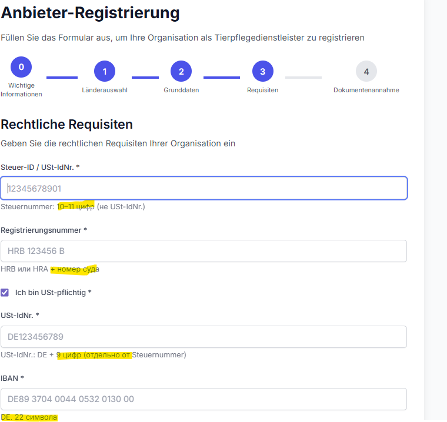

# TODO List - PetCare Project

## Приоритетные задачи (бэкенд)

### 1. Документация ⏳
**Статус:** В ожидании  
**Описание:** Обновить документацию (FunctionalDesign.md):
- Разделить понятия активации провайдера (доступ к настройке) и вывода услуг на фронт потребителям услуг (требует активную оферту)
- Описать логику фильтрации по офертам (провайдер должен иметь активную ProviderOfferAcceptance)
- Добавить информацию о языке в форме заявки
- Описать логику скрытия формы для пользователей с правами provider_admin
- Обновить описание процесса регистрации (упрощенный процесс без одобрения)

### 2. Фильтрация провайдеров по офертам ⏳
**Статус:** В ожидании  
**Описание:** Добавить фильтр по активной оферте во все публичные API провайдеров (ProviderSearchByDistanceAPIView и другие):
- Показывать только провайдеров с активной `ProviderOfferAcceptance` (is_active=True)
- Проверка блокировки по задолженности (через `provider.get_max_overdue_days()` и пороги из оферты)
- Учитывать `activation_status='active'` и `is_active=True` у провайдера

### 3. Скрытие формы для админов провайдеров ⏳
**Статус:** В ожидании  
**Описание:** Добавить проверку в `ProviderFormListCreateAPIView`:
- Скрывать форму для пользователей, у которых уже есть роль `provider_admin` и `is_staff=True`
- Возвращать ошибку или пустой список при GET
- Запрещать создание при POST

### 4. Поле языка в ProviderForm ⏳
**Статус:** В ожидании  
**Описание:** Добавить поле `language` в модель `ProviderForm`:
- CharField с выбором из LANGUAGES (en, ru, me, de)
- Сохранять язык из явного выбора пользователя на фронте (из переключателя языков на странице формы)

### 5. Использование языка при отправке письма ⏳
**Статус:** В ожидании  
**Описание:** Обновить логику отправки письма активации провайдера:
- Использовать язык из `ProviderForm`
- Активировать локаль через `translation.activate(provider_form.language)` перед рендерингом шаблона
- Затем `translation.deactivate()`

### 6. Логика назначения прав админа провайдера ✅
**Статус:** Выполнено  
**Описание:** Проверить логику назначения прав админа провайдера:
- Убедиться, что при активации провайдера автоматически назначаются роль `provider_admin` и `is_staff=True`
- Проверить работу для существующих и новых провайдеров

**Примечание:** Логика работает верно (подтверждено пользователем)

### 7. Настройка доступа к админке для provider_admin ⏳
**Статус:** В ожидании  
**Описание:** Исправить доступ к админке для админов провайдеров:
- **Проблема:** В админке видны только таблицы `providers` и `provider admins`, но нет:
  - Точки (ProviderLocation)
  - Работники (Employee)
  - Расписания (LocationSchedule)
  - Услуги с ценами (ProviderLocationService)
- **Требования:**
  - **Таблица `providers` НЕ должна быть доступна для редактирования** админу провайдера (только просмотр своего провайдера)
  - Добавить `has_module_permission()` для всех необходимых моделей (ProviderLocation, Employee, LocationSchedule, ProviderLocationService)
  - Ограничить доступ только к данным своего провайдера через `get_queryset()`
  - **Убрать возможность выбора других провайдеров** при создании точек, услуг, работников и т.д. (автоматически подставлять свой провайдер)
  - Решить, нужна ли таблица `ProviderAdmin` для редактирования админом провайдера (возможно, только просмотр или скрыть полностью)
  - Убедиться, что все модели из `custom_admin_site.register()` имеют правильные права доступа

---

## Задачи фронтенда (React)

### 8. Страница инструкции на React ⏳
**Статус:** В ожидании  
**Описание:** Создать страницу инструкции на React фронте (`/provider-setup-guide`)

### 9. Пошаговый гайд настройки провайдера ⏳
**Статус:** В ожидании  
**Описание:** Реализовать пошаговый гайд настройки провайдера на React:
- Локации
- Услуги
- Цены
- Персонал
- Время работы

### 10. Защита страницы инструкции ⏳
**Статус:** В ожидании  
**Описание:** Добавить защиту страницы инструкции:
- Доступ только для админов провайдеров (проверка credentials)

---

## Легенда статусов

- ⏳ В ожидании (pending)
- 🔄 В работе (in_progress)
- ✅ Выполнено (completed)
- ❌ Отменено (cancelled)

---

## Задачи улучшения UX регистрации провайдера

**Общее для #11, #12, #13:** мультиязычность (DE, EN, RU, ME) — все подсказки, плейсхолдеры и тексты должны переводиться.

**Источник страны для подсказок:** страна выбирается на шаге 1 мастера; подсказки на шаге 2 зависят от этой выбранной страны.

---

### 11. Подсказки по форматам в зависимости от страны ⏳
**Статус:** В ожидании  
**Оценка времени:** 2-4 часа  
**Описание:** Подсказки для полей **шага 2** — в зависимости от **страны, выбранной на шаге 1**:
- **Телефон организации:** плейсхолдер по стране (DE: `+49 30 12345678`, RU: `+7 495 123-45-67`, UA: `+380 44 123-45-67`, ME: `+382 …` и т.д.)
- **Название организации:** подсказка с примерами ОПФ по стране (DE: "GmbH", "AG", "UG"; RU: "ООО", "ИП", "ЗАО"; UA: "ТОВ", "ПП", "ФОП"; ME: "Doo", "AD" и т.д.)
- Автоформатирование телефона при вводе (маска ввода)
- **Мультиязычность:** плейсхолдеры и подсказки — на DE, EN, RU, ME

### 12. Структурированный адрес с Google Places Autocomplete ⏳
**Статус:** В ожидании  
**Оценка времени:** 4-6 часов  
**Описание:** Улучшить поле адреса на шаге 2:
- Интеграция Google Places Autocomplete API (уже есть Google Maps API)
- Разбор адреса на компоненты (город, улица, дом) после выбора
- Сохранение структурированных данных в модель `Address`
- Fallback на свободный ввод, если автозаполнение не сработало
- **Мультиязычность:** подписи, плейсхолдеры, ошибки — DE, EN, RU, ME

### 13. Загрузка документов — формулировка про необходимость и опциональность ⏳
**Статус:** В ожидании  
**Оценка времени:** 2-3 часа  
**Описание:**
- **Суть:** объяснить в интерфейсе, **нужна ли вообще** загрузка документов. Загрузка **не обязательна**; опциональная загрузка — для повышения доверия.
- **Текст в блоке «Документы» (примеры по языкам):**
  - **RU:** *«По желанию можно загрузить лицензии или сертификаты. Мы будем показывать потребителям отметку «Есть документы» в карточке вашей организации, а по запросу — сами документы. Загрузка не обязательна и не влияет на регистрацию.»*
  - **EN:** *«You may optionally upload licences or certificates. We will show consumers a "Documents available" badge on your organisation's profile and, on request, display the documents. Upload is not required and does not affect registration.»*
  - **DE:** *«Optional können Sie Lizenzen oder Zertifikate hochladen. Wir zeigen Verbrauchern bei Ihrer Einrichtung den Hinweis „Dokumente vorhanden“ und auf Wunsch die Dokumente selbst. Der Upload ist nicht erforderlich und hat keinen Einfluss auf die Registrierung.»*
  - **ME:** *«Po želji možete otpremiti licence ili sertifikate. Potrošačima ćemo prikazivati oznaku „Dokumenti dostupni“ u kartici vaše organizacije, a na zahtjev — same dokumente. Otpremanje nije obavezno i ne utiče na registraciju.»*
- **Реализация:**
  - Оставить поле загрузки опциональным (не блокировать регистрацию)
  - Убрать валидацию «обязательно для requires_license»
  - Показать этот поясняющий текст над/под полем загрузки на шаге 2
- **Мультиязычность:** этот текст — на DE, EN, RU, ME
- **ТЗ (FunctionalDesign.md):** уточнить, что документы опциональны; ответственность за лицензии — на провайдере; при необходимости — пункт в оферту о гарантиях провайдера

---

## Примечания

- Задачи отсортированы по приоритету
- Бэкенд задачи имеют приоритет над фронтенд задачами
- Задача #6 выполнена и подтверждена пользователем
- **ВАЖНО:** Система мигрирована с Contract на PublicOffer. Все задачи про контракты удалены.
- **Упрощенный процесс регистрации:** Провайдер создается автоматически при создании заявки (без одобрения системным админом)
- **Задачи #11, #12, #13:** мультиязычность (DE, EN, RU, ME) для всех текстов; подсказки #11 и #12 зависят от **страны, выбранной на шаге 1** мастера

